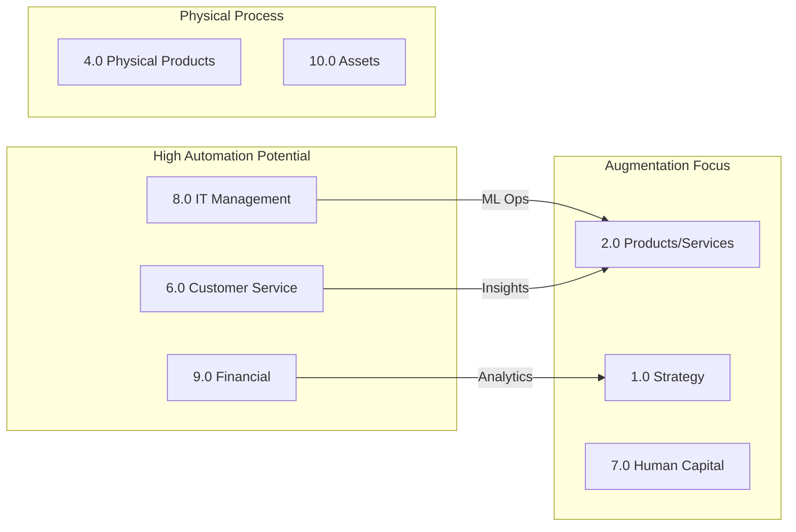

# APQC Process Classification Framework (PCF) - Cross-Industry v7.2.1

> **Source:** APQC Cross-Industry PCF v7.2.1 vs v6.1.1 (April 2023)
> **Total Process Elements:** 1,855 across 13 major categories
> **Purpose:** AI applicability analysis for enterprise process automation

## Overview

The APQC Process Classification Framework (PCF) is the most widely used process framework in the world, providing a common language for organizations to benchmark and improve their business processes. This analysis examines AI applicability across all 13 major enterprise process categories.

## Additional Analysis Documents

| Document | Description | Size |
|----------|-------------|------|
| [APQC-PCF-GLOSSARY.md](./APQC-PCF-GLOSSARY.md) | Complete definitions for all 1,856 elements | 489KB |
| [APQC-PCF-CHANGE-ANALYSIS.md](./APQC-PCF-CHANGE-ANALYSIS.md) | Version change tracking (v7.2.1 vs v6.1.1) | 33KB |
| [APQC-PCF-BENCHMARKABLE-METRICS.md](./APQC-PCF-BENCHMARKABLE-METRICS.md) | 227 processes with APQC metrics | 32KB |

## The 13 Major Enterprise Process Categories

| Category | Process Area | Elements | Metrics |
|----------|-------------|----------|---------|
| 1.0 | [Develop Vision and Strategy](./category-01-develop-vision-and-strategy.md) | 123 | Y |
| 2.0 | [Develop and Manage Products and Services](./category-02-develop-and-manage-products-and-services.md) | 100 | Y |
| 3.0 | [Market and Sell Products and Services](./category-03-market-and-sell-products-and-services.md) | 202 | Y |
| 4.0 | [Deliver Physical Products](./category-04-deliver-physical-products.md) | 147 | Y |
| 5.0 | [Deliver Services](./category-05-deliver-services.md) | 67 | Y |
| 6.0 | [Manage Customer Service](./category-06-manage-customer-service.md) | 104 | Y |
| 7.0 | [Develop and Manage Human Capital](./category-07-develop-and-manage-human-capital.md) | 135 | Y |
| 8.0 | [Manage Information Technology (IT)](./category-08-manage-information-technology-it.md) | 321 | Y |
| 9.0 | [Manage Financial Resources](./category-09-manage-financial-resources.md) | 270 | Y |
| 10.0 | [Acquire, Construct, and Manage Assets](./category-10-acquire-construct-and-manage-assets.md) | 69 | N |
| 11.0 | [Manage Enterprise Risk, Compliance, Remediation, and Resiliency](./category-11-manage-enterprise-risk-compliance-remedi.md) | 56 | N |
| 12.0 | [Manage External Relationships](./category-12-manage-external-relationships.md) | 54 | Y |
| 13.0 | [Develop and Manage Business Capabilities](./category-13-develop-and-manage-business-capabilities.md) | 207 | Y |

## Category Breakdown

### Operating Processes (1.0 - 6.0)

These are the core value-creating processes that directly serve customers:

1. **Develop Vision and Strategy** - Strategic planning and business model development
2. **Develop and Manage Products and Services** - Product/service lifecycle management
3. **Market and Sell Products and Services** - Marketing and sales operations
4. **Deliver Physical Products** - Supply chain and logistics
5. **Deliver Services** - Service delivery operations
6. **Manage Customer Service** - Post-sale customer support

### Management and Support Processes (7.0 - 13.0)

These processes enable and support the operating processes:

7. **Develop and Manage Human Capital** - HR and workforce management
8. **Manage Information Technology (IT)** - IT services and infrastructure
9. **Manage Financial Resources** - Finance, accounting, treasury
10. **Acquire, Construct, and Manage Assets** - Asset lifecycle management
11. **Manage Enterprise Risk, Compliance, Remediation, and Resiliency** - GRC
12. **Manage External Relationships** - Stakeholder and public relations
13. **Develop and Manage Business Capabilities** - Process improvement, analytics

## AI Applicability Considerations

### High AI Applicability Areas

| Category | AI Application Potential |
|----------|-------------------------|
| 8.0 IT Management | Automation, monitoring, incident response |
| 9.0 Financial Resources | Transaction processing, reconciliation, reporting |
| 3.0 Marketing & Sales | Lead scoring, personalization, analytics |
| 6.0 Customer Service | Chatbots, ticket routing, sentiment analysis |
| 13.0 Business Capabilities | Process mining, analytics, knowledge management |

### Transformation Opportunities



## Document Structure

Each category has its own detailed document containing:

- Process hierarchy (up to 5 levels deep)
- PCF IDs for cross-referencing
- Change tracking (v7.2.1 vs v6.1.1)
- Metrics availability indicators

## Source Data

- **File:** K08897_CrossIndustry_v721_vs_v611_April 2023.xlsx
- **Publisher:** APQC (American Productivity & Quality Center)
- **Version:** 7.2.1 compared to 6.1.1
- **Format:** Excel with 19 sheets

## Usage

```bash
# View category overview
cat apqc-pcf-enterprise-processes/APQC-PCF-OVERVIEW.md

# View specific category
cat apqc-pcf-enterprise-processes/category-08-manage-information-technology.md

# Search for specific process
grep -r "customer" apqc-pcf-enterprise-processes/
```

---

**Owner:** CODITECT Research Team  
**License:** APQC Content - See Copyright and Attribution sheet
